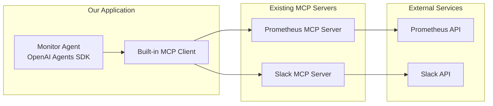
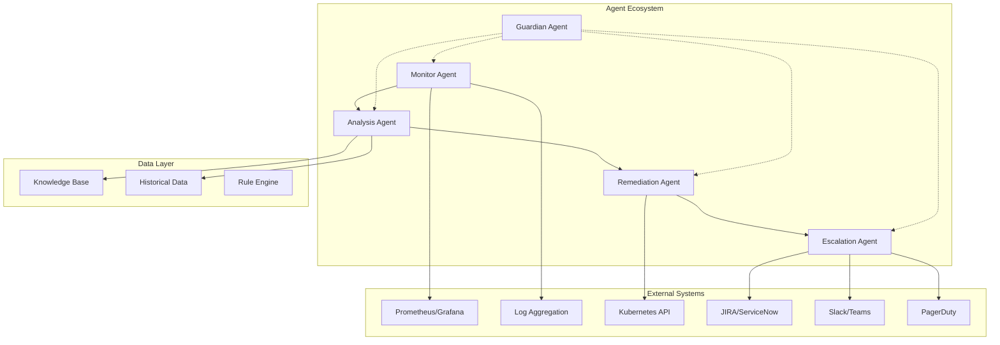
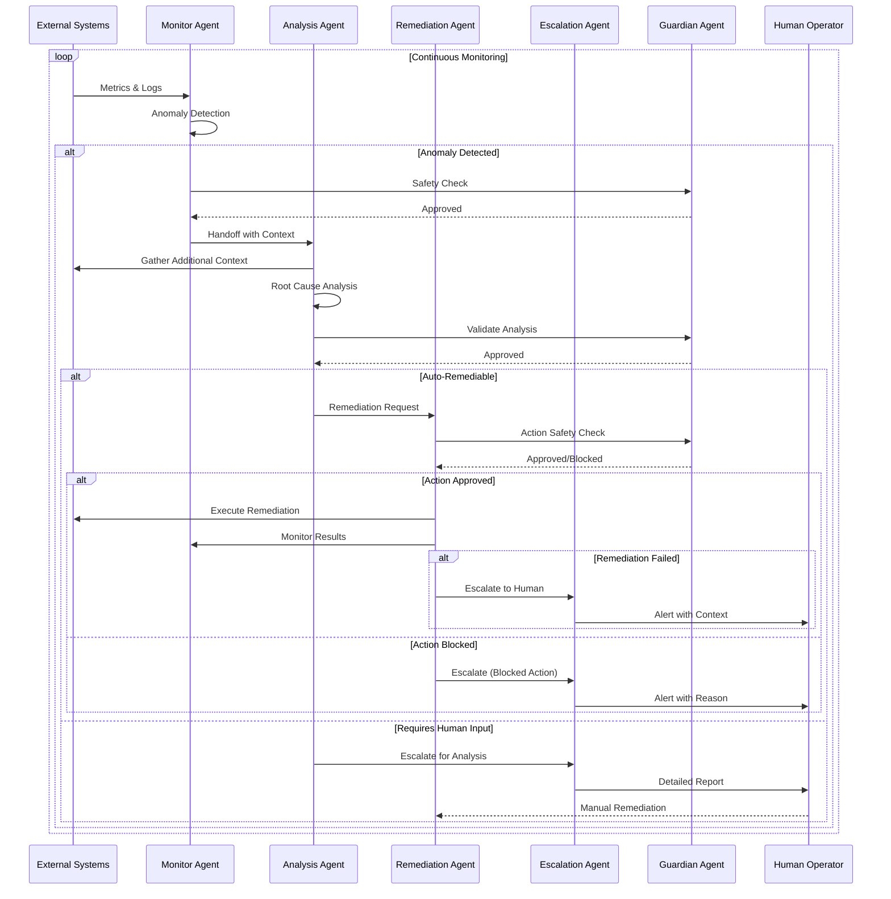
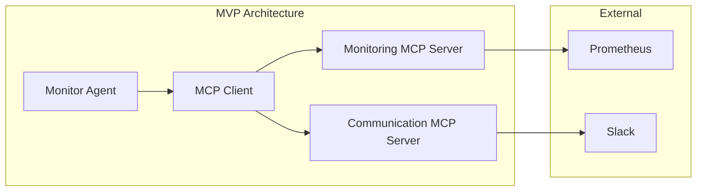
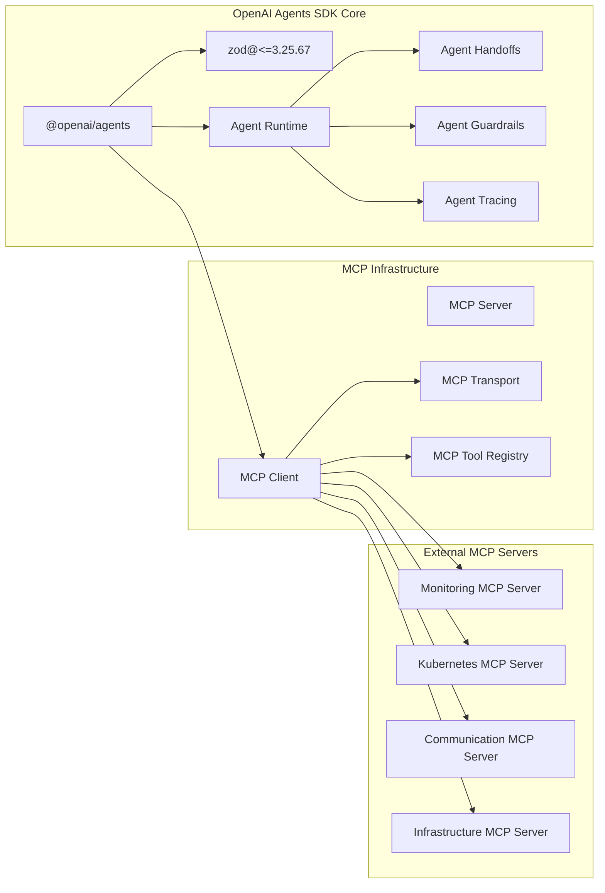
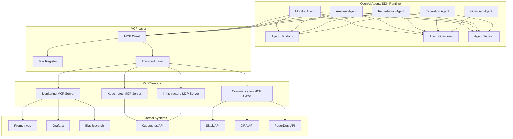
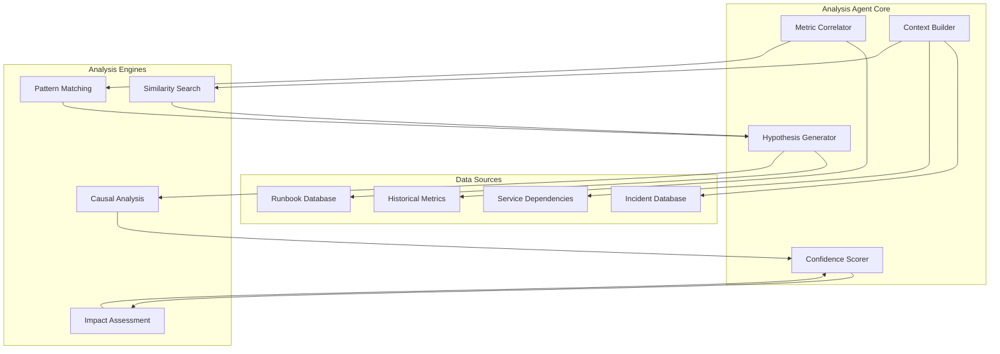
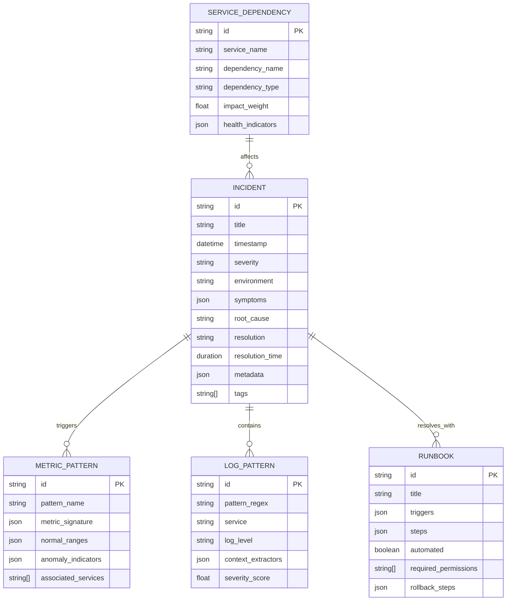

# Abnormality Detection Agent Implementation Plan

## Overview
Build an intelligent system monitoring agent using OpenAI Agents SDK to detect anomalies and coordinate incident response. This agent will act as an orchestration layer on top of existing monitoring infrastructure.

## 🚀 MVP: Simple Threshold Alert Agent (Start Here!)

**Build this first** - A single Monitor Agent that detects CPU/memory threshold violations and sends Slack alerts.

**Why This MVP**:
- Demonstrates core OpenAI Agents SDK usage
- Uses built-in MCP server support (no separate MCP library needed!)
- Provides immediate value with threshold monitoring
- Foundation for more complex features
- **Can be built and tested in one day**

### MVP Architecture


**Key Point**: We act as an MCP **client** connecting to existing MCP servers, not building our own servers.

### MVP Project Structure (Simplified)
```
varuna-mvp/
├── src/
│   ├── agent.ts                 # Single Monitor Agent
│   ├── mcp/
│   │   ├── client.ts           # MCP Client
│   │   ├── monitoring-server.ts # Prometheus integration
│   │   └── communication-server.ts # Slack integration
│   ├── config/
│   │   ├── thresholds.ts       # Threshold rules
│   │   └── environment.ts      # Environment config
│   └── utils/
│       ├── logger.ts
│       └── scheduler.ts
├── package.json
├── tsconfig.json
└── .env
```

### Step-by-Step MVP Implementation

#### Step 1: Project Setup (30 minutes)
```bash
# Initialize project
npm init -y
npm install @openai/agents zod@<=3.25.67 dotenv winston node-cron axios

# TypeScript setup
npm install -D typescript @types/node
npx tsc --init
```

#### Step 2: Basic MCP Monitoring Server (2 hours)
```typescript
// src/mcp/monitoring-server.ts
export class MonitoringMCPServer {
  async fetchMetrics(query: string, timeRange: { start: string; end: string }) {
    // Simple Prometheus query implementation
    const response = await axios.get(`${PROMETHEUS_URL}/api/v1/query_range`, {
      params: {
        query,
        start: timeRange.start,
        end: timeRange.end,
        step: '1m'
      }
    });
    return response.data;
  }
  
  async checkThreshold(metric: string, threshold: number, duration: string) {
    // Basic threshold checking logic
    const data = await this.fetchMetrics(metric, {
      start: new Date(Date.now() - parseDuration(duration)).toISOString(),
      end: new Date().toISOString()
    });
    
    return this.evaluateThreshold(data, threshold);
  }
}
```

#### Step 3: Basic MCP Communication Server (1 hour)
```typescript
// src/mcp/communication-server.ts
export class CommunicationMCPServer {
  async sendSlackAlert(channel: string, message: string, severity: string) {
    const color = severity === 'critical' ? 'danger' : 'warning';
    
    return await axios.post(`https://slack.com/api/chat.postMessage`, {
      channel,
      attachments: [{
        color,
        title: `${severity.toUpperCase()} Alert`,
        text: message,
        ts: Math.floor(Date.now() / 1000)
      }]
    }, {
      headers: { 'Authorization': `Bearer ${SLACK_TOKEN}` }
    });
  }
}
```

#### Step 4: Simple Monitor Agent (3 hours)
```typescript
// src/agent.ts
import { Agent, run } from '@openai/agents';

const monitorAgent = new Agent({
  name: 'SimpleMonitorAgent',
  instructions: `
    You are a system monitoring agent that checks CPU and memory thresholds.
    
    Every minute:
    1. Check CPU usage across all nodes
    2. Check memory usage across all nodes
    3. If any threshold is exceeded for 5+ minutes, send a Slack alert
    4. Include current values, threshold, and duration in the alert
    
    Thresholds:
    - CPU: 80%
    - Memory: 85%
    
    Only send alerts for sustained violations (5+ minutes).
    Do not spam - max one alert per issue per hour.
  `,
  tools: [
    {
      name: 'fetch_metrics',
      description: 'Query Prometheus for system metrics',
      inputSchema: {
        type: 'object',
        properties: {
          query: { type: 'string' },
          timeRange: { type: 'object' }
        }
      },
      handler: async (input) => {
        return await monitoringServer.fetchMetrics(input.query, input.timeRange);
      }
    },
    {
      name: 'send_slack_alert',
      description: 'Send alert to Slack channel',
      inputSchema: {
        type: 'object',
        properties: {
          message: { type: 'string' },
          severity: { type: 'string' }
        }
      },
      handler: async (input) => {
        return await communicationServer.sendSlackAlert(
          '#alerts', 
          input.message, 
          input.severity
        );
      }
    }
  ],
  guardrails: [
    {
      name: 'AlertRateLimit',
      validate: async () => {
        // Prevent alert spam - max 1 alert per hour per issue
        return { blocked: false };
      }
    }
  ]
});

// Run monitoring loop
setInterval(async () => {
  try {
    await run(monitorAgent, 'Check system metrics and alert if thresholds exceeded');
  } catch (error) {
    logger.error('Monitoring run failed:', error);
  }
}, 60000); // Every minute
```

#### Step 5: Configuration & Environment (30 minutes)
```typescript
// src/config/thresholds.ts
export const thresholds = {
  cpu: { limit: 80, duration: '5m' },
  memory: { limit: 85, duration: '5m' }
};

// .env
OPENAI_API_KEY=sk-...
PROMETHEUS_URL=http://localhost:9090
SLACK_TOKEN=xoxb-...
SLACK_CHANNEL=#alerts
LOG_LEVEL=info
```

#### Step 6: Testing & Deployment (2 hours)
```typescript
// Simple test to verify everything works
async function testMVP() {
  // Test Prometheus connection
  const metrics = await monitoringServer.fetchMetrics('up', {
    start: new Date(Date.now() - 300000).toISOString(),
    end: new Date().toISOString()
  });
  
  // Test Slack connection
  await communicationServer.sendSlackAlert('#alerts', 'Test alert', 'info');
  
  // Test agent
  const result = await run(monitorAgent, 'Run a test monitoring check');
  
  console.log('MVP test completed successfully');
}
```

### MVP Success Metrics

**Functional Requirements**:
- [ ] Detects CPU > 80% for 5+ minutes
- [ ] Detects Memory > 85% for 5+ minutes  
- [ ] Sends formatted Slack alerts
- [ ] Prevents alert spam (max 1/hour per issue)
- [ ] Logs all actions with timestamps

**Non-Functional Requirements**:
- [ ] Runs continuously without crashes
- [ ] Handles Prometheus/Slack API failures gracefully
- [ ] Uses < 100MB memory
- [ ] Response time < 30 seconds per check

**Business Value**:
- [ ] Catches real production issues
- [ ] Reduces mean time to detection by 50%
- [ ] Zero false positives in first week
- [ ] Team can understand and modify the code

**Total Time Estimate: 8-9 hours (one development day)**

---

## System Architecture (Full Vision)

### Core Agents Overview


### Agent Responsibilities

#### 1. Monitor Agent
- **Primary Function**: Continuous system observation and anomaly detection
- **Decision Making**: Determines when to escalate to Analysis Agent
- **Guardrails**: Rate limiting, query validation, metric sanity checks

#### 2. Analysis Agent  
- **Primary Function**: Root cause analysis and incident context building
- **Decision Making**: Recommends remediation actions or escalation paths
- **Guardrails**: Context validation, confidence scoring, bias detection

#### 3. Remediation Agent
- **Primary Function**: Automated fix execution with comprehensive safety checks
- **Decision Making**: Risk assessment before action execution
- **Guardrails**: Action whitelisting, rollback planning, change approval

#### 4. Escalation Agent
- **Primary Function**: Human coordination and communication management
- **Decision Making**: Escalation timing and recipient selection
- **Guardrails**: Message validation, recipient verification, priority scoring

#### 5. Guardian Agent
- **Primary Function**: Cross-agent safety monitoring and override capabilities
- **Decision Making**: Emergency stops and safety interventions
- **Guardrails**: System-wide safety enforcement, audit logging

## Detailed Data Flow



## Implementation Strategy

### MVP: Simple Threshold Alert Agent

**Scope**: Build a single Monitor Agent that detects CPU/memory threshold violations and sends Slack alerts.

**Why This MVP**:
- Demonstrates core OpenAI Agents SDK usage
- Shows MCP integration pattern
- Provides immediate value with threshold monitoring
- Foundation for more complex features
- Can be built and tested in days, not weeks



**MVP Implementation Steps**:
1. Create basic OpenAI Agents SDK setup
2. Build minimal Monitoring MCP Server (Prometheus only)
3. Build minimal Communication MCP Server (Slack only)
4. Implement single Monitor Agent with threshold detection
5. Add basic guardrails and error handling
6. Deploy and test with real metrics

---

## Incremental Development Phases

### Phase 0: MVP - Simple Threshold Alert Agent

**Deliverable**: Working threshold monitoring with Slack alerts

**Components**:
- Monitor Agent (OpenAI Agents SDK)
- Monitoring MCP Server (Prometheus integration only)
- Communication MCP Server (Slack integration only)
- Basic threshold rules engine
- Simple alert formatting

**Success Criteria**:
- Detects when CPU > 80% for 5 minutes
- Sends formatted Slack alert with context
- Handles API failures gracefully
- Logs all actions for debugging

### Phase 1: Enhanced Monitoring Agent

**Deliverable**: Multi-metric monitoring with log correlation

**New Components**:
- Log parsing capabilities in Monitoring MCP Server
- Enhanced threshold rules (multiple conditions)
- Basic metric correlation
- Alert deduplication

**Success Criteria**:
- Monitors CPU, memory, disk, network metrics
- Correlates metrics with error logs
- Reduces false positives by 50%
- Provides richer alert context

### Phase 2: Analysis Agent Introduction

**Deliverable**: Root cause analysis and incident context

**New Components**:
- Analysis Agent with OpenAI Agents SDK handoffs
- Knowledge base for historical incidents
- Incident context builder
- Pattern recognition for common issues

**Success Criteria**:
- Monitor Agent hands off to Analysis Agent for complex issues
- Analysis Agent provides probable root cause
- Historical incident matching works
- Context includes timeline and affected services

### Phase 3: Safe Remediation

**Deliverable**: Automated fixes for common issues

**New Components**:
- Remediation Agent with strict guardrails
- Kubernetes MCP Server
- Rollback capabilities
- Approval workflows for risky actions

**Success Criteria**:
- Automatically restarts failed pods
- Scales deployments when needed
- Requires human approval for production changes
- All actions are reversible

### Phase 4: Human Integration

**Deliverable**: Complete incident management workflow

**New Components**:
- Escalation Agent
- JIRA integration in Communication MCP Server
- PagerDuty integration
- Incident templates and runbooks

**Success Criteria**:
- Creates JIRA tickets automatically
- Escalates to on-call via PagerDuty
- Maintains incident timeline
- Generates post-incident reports

### Phase 5: Advanced Features

**Deliverable**: ML-enhanced detection and multi-tenant support

**New Components**:
- External ML service integration
- Multi-environment support
- Advanced correlation algorithms
- Performance optimization

---

## Phase 0 MVP: Detailed Implementation Plan

### MVP Project Structure (Simplified)
```
varuna-mvp/
├── src/
│   ├── agent.ts                 # Single Monitor Agent
│   ├── mcp/
│   │   ├── client.ts           # MCP Client
│   │   ├── monitoring-server.ts # Prometheus integration
│   │   └── communication-server.ts # Slack integration
│   ├── config/
│   │   ├── thresholds.ts       # Threshold rules
│   │   └── environment.ts      # Environment config
│   └── utils/
│       ├── logger.ts
│       └── scheduler.ts
├── package.json
├── tsconfig.json
└── .env
```

### Step-by-Step MVP Implementation

#### Step 1: Project Setup (30 minutes)
```bash
# Initialize project
npm init -y
npm install @openai/agents zod@<=3.25.67 dotenv winston node-cron axios

# TypeScript setup
npm install -D typescript @types/node
npx tsc --init
```

#### Step 2: Basic MCP Monitoring Server (2 hours)
```typescript
// src/mcp/monitoring-server.ts
export class MonitoringMCPServer {
  async fetchMetrics(query: string, timeRange: { start: string; end: string }) {
    // Simple Prometheus query implementation
    const response = await axios.get(`${PROMETHEUS_URL}/api/v1/query_range`, {
      params: {
        query,
        start: timeRange.start,
        end: timeRange.end,
        step: '1m'
      }
    });
    return response.data;
  }
  
  async checkThreshold(metric: string, threshold: number, duration: string) {
    // Basic threshold checking logic
    const data = await this.fetchMetrics(metric, {
      start: new Date(Date.now() - parseDuration(duration)).toISOString(),
      end: new Date().toISOString()
    });
    
    return this.evaluateThreshold(data, threshold);
  }
}
```

#### Step 3: Basic MCP Communication Server (1 hour)
```typescript
// src/mcp/communication-server.ts
export class CommunicationMCPServer {
  async sendSlackAlert(channel: string, message: string, severity: string) {
    const color = severity === 'critical' ? 'danger' : 'warning';
    
    return await axios.post(`https://slack.com/api/chat.postMessage`, {
      channel,
      attachments: [{
        color,
        title: `${severity.toUpperCase()} Alert`,
        text: message,
        ts: Math.floor(Date.now() / 1000)
      }]
    }, {
      headers: { 'Authorization': `Bearer ${SLACK_TOKEN}` }
    });
  }
}
```

#### Step 4: Simple Monitor Agent (3 hours)
```typescript
// src/agent.ts
import { Agent, run } from '@openai/agents';

const monitorAgent = new Agent({
  name: 'SimpleMonitorAgent',
  instructions: `
    You are a system monitoring agent that checks CPU and memory thresholds.
    
    Every minute:
    1. Check CPU usage across all nodes
    2. Check memory usage across all nodes
    3. If any threshold is exceeded for 5+ minutes, send a Slack alert
    4. Include current values, threshold, and duration in the alert
    
    Thresholds:
    - CPU: 80%
    - Memory: 85%
    
    Only send alerts for sustained violations (5+ minutes).
    Do not spam - max one alert per issue per hour.
  `,
  tools: [
    {
      name: 'fetch_metrics',
      description: 'Query Prometheus for system metrics',
      inputSchema: {
        type: 'object',
        properties: {
          query: { type: 'string' },
          timeRange: { type: 'object' }
        }
      },
      handler: async (input) => {
        return await monitoringServer.fetchMetrics(input.query, input.timeRange);
      }
    },
    {
      name: 'send_slack_alert',
      description: 'Send alert to Slack channel',
      inputSchema: {
        type: 'object',
        properties: {
          message: { type: 'string' },
          severity: { type: 'string' }
        }
      },
      handler: async (input) => {
        return await communicationServer.sendSlackAlert(
          '#alerts', 
          input.message, 
          input.severity
        );
      }
    }
  ],
  guardrails: [
    {
      name: 'AlertRateLimit',
      validate: async () => {
        // Prevent alert spam - max 1 alert per hour per issue
        return { blocked: false };
      }
    }
  ]
});

// Run monitoring loop
setInterval(async () => {
  try {
    await run(monitorAgent, 'Check system metrics and alert if thresholds exceeded');
  } catch (error) {
    logger.error('Monitoring run failed:', error);
  }
}, 60000); // Every minute
```

#### Step 5: Configuration & Environment (30 minutes)
```typescript
// src/config/thresholds.ts
export const thresholds = {
  cpu: { limit: 80, duration: '5m' },
  memory: { limit: 85, duration: '5m' }
};

// .env
OPENAI_API_KEY=sk-...
PROMETHEUS_URL=http://localhost:9090
SLACK_TOKEN=xoxb-...
SLACK_CHANNEL=#alerts
LOG_LEVEL=info
```

#### Step 6: Testing & Deployment (2 hours)
```typescript
// Simple test to verify everything works
async function testMVP() {
  // Test Prometheus connection
  const metrics = await monitoringServer.fetchMetrics('up', {
    start: new Date(Date.now() - 300000).toISOString(),
    end: new Date().toISOString()
  });
  
  // Test Slack connection
  await communicationServer.sendSlackAlert('#alerts', 'Test alert', 'info');
  
  // Test agent
  const result = await run(monitorAgent, 'Run a test monitoring check');
  
  console.log('MVP test completed successfully');
}
```

### MVP Deployment Strategy

**Local Development**:
1. Run Prometheus locally with sample metrics
2. Create test Slack workspace/channel
3. Start the agent with `npm start`
4. Trigger threshold violations to test alerts

**Production Deployment**:
1. Deploy to container (Docker/Kubernetes)
2. Configure environment variables
3. Set up monitoring of the monitoring agent itself
4. Configure log aggregation

### MVP Success Metrics

**Functional Requirements**:
- [ ] Detects CPU > 80% for 5+ minutes
- [ ] Detects Memory > 85% for 5+ minutes  
- [ ] Sends formatted Slack alerts
- [ ] Prevents alert spam (max 1/hour per issue)
- [ ] Logs all actions with timestamps

**Non-Functional Requirements**:
- [ ] Runs continuously without crashes
- [ ] Handles Prometheus/Slack API failures gracefully
- [ ] Uses < 100MB memory
- [ ] Response time < 30 seconds per check

**Business Value**:
- [ ] Catches real production issues
- [ ] Reduces mean time to detection by 50%
- [ ] Zero false positives in first week
- [ ] Team can understand and modify the code

This MVP can be built in **one day** and provides immediate value while demonstrating the full OpenAI Agents SDK + MCP pattern.



### Detailed Directory Structure
```
varuna/
├── src/
│   ├── agents/                    # OpenAI Agents SDK implementations
│   │   ├── monitor.ts            # Monitor Agent using OpenAI Agents
│   │   ├── analysis.ts           # Analysis Agent with handoffs
│   │   ├── remediation.ts        # Remediation Agent with guardrails
│   │   ├── escalation.ts         # Escalation Agent for human coordination
│   │   └── guardian.ts           # Guardian Agent for safety oversight
│   ├── mcp/                      # MCP Server and Client implementations
│   │   ├── servers/
│   │   │   ├── monitoring/       # Monitoring MCP Server
│   │   │   │   ├── index.ts
│   │   │   │   ├── prometheus.ts
│   │   │   │   ├── grafana.ts
│   │   │   │   ├── logs.ts
│   │   │   │   └── tools.ts
│   │   │   ├── kubernetes/       # Kubernetes MCP Server
│   │   │   │   ├── index.ts
│   │   │   │   ├── pods.ts
│   │   │   │   ├── services.ts
│   │   │   │   ├── deployments.ts
│   │   │   │   └── tools.ts
│   │   │   ├── communication/    # Communication MCP Server
│   │   │   │   ├── index.ts
│   │   │   │   ├── slack.ts
│   │   │   │   ├── jira.ts
│   │   │   │   ├── pagerduty.ts
│   │   │   │   └── tools.ts
│   │   │   └── infrastructure/   # Infrastructure MCP Server
│   │   │       ├── index.ts
│   │   │       ├── docker.ts
│   │   │       ├── terraform.ts
│   │   │       └── tools.ts
│   │   ├── client/               # MCP Client for agents
│   │   │   ├── index.ts
│   │   │   ├── transport.ts
│   │   │   ├── registry.ts
│   │   │   └── connection-manager.ts
│   │   └── types/                # MCP-specific types
│   │       ├── monitoring.ts
│   │       ├── kubernetes.ts
│   │       ├── communication.ts
│   │       └── infrastructure.ts
│   ├── tools/                    # Agent tools that use MCP
│   │   ├── monitoring-tools.ts   # Wraps monitoring MCP calls
│   │   ├── k8s-tools.ts         # Wraps Kubernetes MCP calls
│   │   ├── communication-tools.ts # Wraps communication MCP calls
│   │   └── infrastructure-tools.ts # Wraps infrastructure MCP calls
│   ├── guardrails/               # OpenAI Agents SDK guardrails
│   │   ├── input-validation.ts
│   │   ├── output-sanitization.ts
│   │   ├── rate-limiting.ts
│   │   ├── safety-checks.ts
│   │   └── approval-gates.ts
│   ├── config/
│   │   ├── agents.ts            # Agent configurations
│   │   ├── mcp-servers.ts       # MCP server configurations
│   │   ├── thresholds.ts
│   │   └── environments.ts
│   ├── data/
│   │   ├── knowledge-base/
│   │   ├── historical-incidents/
│   │   ├── runbooks/
│   │   └── templates/
│   ├── utils/
│   │   ├── logger.ts
│   │   ├── tracing.ts           # OpenAI Agents SDK tracing
│   │   ├── metrics.ts
│   │   └── helpers.ts
│   └── types/
│       ├── agents.ts            # OpenAI Agents SDK types
│       ├── incidents.ts
│       └── common.ts
├── mcp-configs/                 # MCP server configurations
│   ├── monitoring-server.json
│   ├── kubernetes-server.json
│   ├── communication-server.json
│   └── infrastructure-server.json
├── tests/
├── docs/
└── scripts/
```

### OpenAI Agents SDK Implementation with MCP Integration

#### System Architecture with MCP


#### OpenAI Agents SDK Agent Implementation

**Monitor Agent with MCP Tools**
```typescript
import { Agent, run } from '@openai/agents';
import { MCPClient } from './mcp/client';

const monitorAgent = new Agent({
  name: 'MonitorAgent',
  instructions: `
    You are a system monitoring agent that detects anomalies in infrastructure metrics and logs.
    Use the MCP tools to query monitoring systems and detect unusual patterns.
    When you detect an anomaly, handoff to the Analysis Agent with detailed context.
    
    Your responsibilities:
    - Query metrics from Prometheus/Grafana via monitoring MCP server
    - Parse logs from Elasticsearch via monitoring MCP server  
    - Apply threshold-based anomaly detection
    - Generate structured alerts for handoff to Analysis Agent
  `,
  tools: [
    // MCP tools are automatically registered via the MCP client
    'mcp__monitoring__fetch_metrics',
    'mcp__monitoring__query_logs', 
    'mcp__monitoring__check_thresholds',
    'mcp__monitoring__create_alert'
  ],
  guardrails: [
    {
      name: 'MonitoringRateLimit',
      validate: async (input) => {
        // Rate limiting logic for monitoring APIs
        return { blocked: false };
      }
    },
    {
      name: 'QueryValidation',
      validate: async (input) => {
        // Validate monitoring queries for safety
        return { blocked: false };
      }
    }
  ]
});
```

**MCP Tool Integration Pattern**
```typescript
// Agent tools that wrap MCP calls
export const monitoringTools = {
  fetchMetrics: async (query: MetricsQuery) => {
    return await mcpClient.call('monitoring', 'fetch_metrics', query);
  },
  
  queryLogs: async (query: LogQuery) => {
    return await mcpClient.call('monitoring', 'query_logs', query);
  },
  
  checkThresholds: async (metrics: MetricData[], rules: ThresholdRule[]) => {
    return await mcpClient.call('monitoring', 'check_thresholds', { metrics, rules });
  },
  
  createAlert: async (anomaly: AnomalyData) => {
    return await mcpClient.call('monitoring', 'create_alert', anomaly);
  }
};
```

## MCP Server Specifications

### Monitoring MCP Server
```typescript
// mcp/servers/monitoring/index.ts
export class MonitoringMCPServer {
  tools = [
    {
      name: 'fetch_metrics',
      description: 'Query metrics from Prometheus, Grafana, or other monitoring systems',
      inputSchema: {
        type: 'object',
        properties: {
          source: {
            type: 'string',
            enum: ['prometheus', 'grafana', 'cloudwatch', 'datadog']
          },
          query: { type: 'string' },
          timeRange: {
            type: 'object',
            properties: {
              start: { type: 'string' },
              end: { type: 'string' },
              step: { type: 'string', optional: true }
            }
          }
        }
      }
    },
    {
      name: 'query_logs',
      description: 'Search and analyze logs from centralized logging systems',
      inputSchema: {
        type: 'object',
        properties: {
          source: {
            type: 'string', 
            enum: ['elasticsearch', 'splunk', 'loki', 'cloudwatch']
          },
          filters: {
            type: 'object',
            properties: {
              timeRange: { type: 'object' },
              services: { type: 'array', items: { type: 'string' } },
              logLevels: { type: 'array', items: { type: 'string' } },
              keywords: { type: 'array', items: { type: 'string' } }
            }
          }
        }
      }
    },
    {
      name: 'check_thresholds',
      description: 'Apply threshold rules to metrics for anomaly detection',
      inputSchema: {
        type: 'object',
        properties: {
          metrics: { type: 'array' },
          rules: { type: 'array' }
        }
      }
    },
    {
      name: 'create_alert',
      description: 'Generate structured alerts from detected anomalies',
      inputSchema: {
        type: 'object',
        properties: {
          anomaly: { type: 'object' },
          severity: { type: 'string' },
          context: { type: 'object' }
        }
      }
    }
  ];
}
```

### Kubernetes MCP Server
```typescript
// mcp/servers/kubernetes/index.ts
export class KubernetesMCPServer {
  tools = [
    {
      name: 'get_pods',
      description: 'List and filter Kubernetes pods',
      inputSchema: {
        type: 'object',
        properties: {
          namespace: { type: 'string', optional: true },
          selector: { type: 'string', optional: true },
          status: { type: 'string', optional: true }
        }
      }
    },
    {
      name: 'describe_pod',
      description: 'Get detailed information about a specific pod',
      inputSchema: {
        type: 'object',
        properties: {
          name: { type: 'string' },
          namespace: { type: 'string' }
        }
      }
    },
    {
      name: 'restart_deployment',
      description: 'Restart a Kubernetes deployment',
      inputSchema: {
        type: 'object',
        properties: {
          name: { type: 'string' },
          namespace: { type: 'string' }
        }
      }
    },
    {
      name: 'scale_deployment',
      description: 'Scale a Kubernetes deployment',
      inputSchema: {
        type: 'object',
        properties: {
          name: { type: 'string' },
          namespace: { type: 'string' },
          replicas: { type: 'number' }
        }
      }
    },
    {
      name: 'get_events',
      description: 'Get Kubernetes events for troubleshooting',
      inputSchema: {
        type: 'object',
        properties: {
          namespace: { type: 'string', optional: true },
          fieldSelector: { type: 'string', optional: true }
        }
      }
    }
  ];
}
```

### Communication MCP Server
```typescript
// mcp/servers/communication/index.ts
export class CommunicationMCPServer {
  tools = [
    {
      name: 'send_slack_message',
      description: 'Send messages to Slack channels',
      inputSchema: {
        type: 'object',
        properties: {
          channel: { type: 'string' },
          message: { type: 'string' },
          severity: { type: 'string', optional: true },
          thread_ts: { type: 'string', optional: true }
        }
      }
    },
    {
      name: 'create_jira_ticket',
      description: 'Create JIRA tickets for incident tracking',
      inputSchema: {
        type: 'object',
        properties: {
          project: { type: 'string' },
          summary: { type: 'string' },
          description: { type: 'string' },
          priority: { type: 'string' },
          issueType: { type: 'string' },
          assignee: { type: 'string', optional: true }
        }
      }
    },
    {
      name: 'trigger_pagerduty_alert',
      description: 'Trigger PagerDuty alerts for critical incidents',
      inputSchema: {
        type: 'object',
        properties: {
          service_key: { type: 'string' },
          description: { type: 'string' },
          severity: { type: 'string' },
          details: { type: 'object', optional: true }
        }
      }
    },
    {
      name: 'send_email',
      description: 'Send email notifications',
      inputSchema: {
        type: 'object',
        properties: {
          to: { type: 'array', items: { type: 'string' } },
          subject: { type: 'string' },
          body: { type: 'string' },
          priority: { type: 'string', optional: true }
        }
      }
    }
  ];
}
```

### Infrastructure MCP Server
```typescript
// mcp/servers/infrastructure/index.ts
export class InfrastructureMCPServer {
  tools = [
    {
      name: 'docker_container_status',
      description: 'Check Docker container status and health',
      inputSchema: {
        type: 'object',
        properties: {
          container: { type: 'string' },
          host: { type: 'string', optional: true }
        }
      }
    },
    {
      name: 'restart_docker_container',
      description: 'Restart Docker containers',
      inputSchema: {
        type: 'object',
        properties: {
          container: { type: 'string' },
          host: { type: 'string', optional: true }
        }
      }
    },
    {
      name: 'terraform_plan',
      description: 'Run Terraform plan for infrastructure changes',
      inputSchema: {
        type: 'object',
        properties: {
          workspace: { type: 'string' },
          path: { type: 'string' }
        }
      }
    },
    {
      name: 'terraform_apply',
      description: 'Apply Terraform changes (requires approval)',
      inputSchema: {
        type: 'object',
        properties: {
          workspace: { type: 'string' },
          path: { type: 'string' },
          auto_approve: { type: 'boolean', default: false }
        }
      }
    }
  ];
}
```

#### Guardrails Implementation

**Input Validation Guardrail**
```typescript
const monitorInputGuardrail = {
  name: 'MonitorInputValidation',
  validate: async (input: any) => {
    const schema = z.object({
      query: z.string().max(1000),
      timeRange: z.object({
        start: z.string().datetime(),
        end: z.string().datetime()
      }),
      source: z.enum(['prometheus', 'grafana', 'elasticsearch'])
    });
    
    return schema.parse(input);
  },
  onError: (error) => {
    logger.warn('Invalid monitor input', { error });
    return { blocked: true, reason: 'Invalid input parameters' };
  }
};
```

**Rate Limiting Guardrail**
```typescript
const rateLimitGuardrail = {
  name: 'MonitorRateLimit',
  limits: {
    prometheus: { requests: 100, window: '1m' },
    elasticsearch: { requests: 50, window: '1m' },
    kubernetes: { requests: 30, window: '1m' }
  },
  validate: async (source: string) => {
    const limit = this.limits[source];
    const current = await redis.get(`rate_limit:${source}`);
    
    if (current && parseInt(current) >= limit.requests) {
      return { blocked: true, reason: `Rate limit exceeded for ${source}` };
    }
    
    return { blocked: false };
  }
};
```

## Phase 2: Analysis & Context Engine

### Analysis Agent Architecture



### Detailed Tool Implementations

**correlateMetrics Tool**
```typescript
interface CorrelationQuery {
  primaryAnomaly: {
    metric: string;
    timestamp: string;
    value: number;
    baseline: number;
    deviation: number;
  };
  timeWindow: {
    before: string; // e.g., "15m"
    after: string;  // e.g., "5m"
  };
  services: string[];
  correlationThreshold: number; // 0.0 to 1.0
}

interface CorrelationResult {
  correlatedMetrics: Array<{
    metric: string;
    service: string;
    correlation: number;
    timeOffset: string;
    significance: 'high' | 'medium' | 'low';
    pattern: 'leading' | 'lagging' | 'simultaneous';
  }>;
  dependencyChain: Array<{
    service: string;
    dependency: string;
    type: 'upstream' | 'downstream';
    impact: number;
  }>;
  confidence: number;
}
```

**extractLogContext Tool**
```typescript
interface LogContextQuery {
  anomaly: {
    service: string;
    timestamp: string;
    metric: string;
    severity: string;
  };
  contextWindow: {
    before: string;
    after: string;
  };
  logSources: string[];
  analysisDepth: 'shallow' | 'deep' | 'comprehensive';
}

interface LogContextResult {
  errorPatterns: Array<{
    pattern: string;
    frequency: number;
    services: string[];
    correlation: number;
    examples: string[];
  }>;
  anomalousEvents: Array<{
    timestamp: string;
    service: string;
    event: string;
    severity: string;
    context: Record<string, any>;
  }>;
  serviceInteractions: Array<{
    caller: string;
    callee: string;
    errorRate: number;
    latency: number;
    volume: number;
  }>;
  rootCauseIndicators: Array<{
    indicator: string;
    confidence: number;
    evidence: string[];
    timeline: string;
  }>;
}
```

**queryKnowledgeBase Tool**
```typescript
interface KnowledgeQuery {
  symptoms: {
    metrics: string[];
    logPatterns: string[];
    services: string[];
    errorTypes: string[];
  };
  similarity: {
    algorithm: 'cosine' | 'jaccard' | 'levenshtein';
    threshold: number;
    maxResults: number;
  };
  filters: {
    timeRange?: { start: string; end: string; };
    severity?: string[];
    environment?: string[];
    tags?: string[];
  };
}

interface KnowledgeResult {
  similarIncidents: Array<{
    id: string;
    title: string;
    similarity: number;
    symptoms: string[];
    rootCause: string;
    resolution: string;
    resolutionTime: string;
    tags: string[];
  }>;
  suggestedActions: Array<{
    action: string;
    priority: number;
    confidence: number;
    riskLevel: 'low' | 'medium' | 'high';
    estimatedTime: string;
    prerequisites: string[];
  }>;
  relevantRunbooks: Array<{
    id: string;
    title: string;
    applicability: number;
    steps: string[];
    automation: boolean;
  }>;
}
```

### Knowledge Base Schema



### Context Builder Implementation

```typescript
class ContextBuilder {
  private async buildIncidentContext(anomaly: AnomalyData): Promise<IncidentContext> {
    const correlations = await this.correlateMetrics(anomaly);
    const logContext = await this.extractLogContext(anomaly);
    const historicalData = await this.queryKnowledgeBase(anomaly.symptoms);
    const dependencies = await this.analyzeDependencies(anomaly.service);
    
    return {
      anomaly,
      correlations,
      logContext,
      historicalData,
      dependencies,
      timeline: this.buildTimeline(anomaly, correlations, logContext),
      confidence: this.calculateConfidence(correlations, logContext, historicalData),
      riskAssessment: this.assessRisk(anomaly, dependencies),
      recommendedActions: this.generateRecommendations(historicalData, dependencies)
    };
  }
  
  private buildTimeline(
    anomaly: AnomalyData,
    correlations: CorrelationResult,
    logContext: LogContextResult
  ): Timeline {
    const events = [
      { timestamp: anomaly.timestamp, type: 'anomaly', data: anomaly },
      ...correlations.correlatedMetrics.map(m => ({
        timestamp: this.adjustTimestamp(anomaly.timestamp, m.timeOffset),
        type: 'metric_correlation',
        data: m
      })),
      ...logContext.anomalousEvents
    ].sort((a, b) => new Date(a.timestamp).getTime() - new Date(b.timestamp).getTime());
    
    return { events, duration: this.calculateDuration(events) };
  }
}
```

## Phase 3: Safe Remediation Engine

### 3.1 Remediation Agent
**Capabilities:**
- Execute pre-approved remediation actions
- Restart services and scale resources
- Apply configuration changes
- Rollback deployments

**Tools Required:**
- `restartService(service, environment)` - Service management
- `scaleResource(resource, replicas)` - Auto-scaling
- `executeRunbook(procedure, params)` - Standardized fixes
- `rollbackDeployment(service, version)` - Emergency rollback

**Critical Guardrails:**
- Whitelist of allowed actions per environment
- Mandatory human approval for production changes
- Automatic backup before any changes
- Rollback capability for all actions

### 3.2 Safety Mechanisms
- Multi-factor approval for critical systems
- Change impact assessment before execution
- Automatic testing of remediation effectiveness
- Emergency stop functionality

## Phase 4: Human Integration (Weeks 7-8)

### 4.1 Escalation Agent
**Capabilities:**
- Determine escalation criteria
- Generate human-readable incident reports
- Interface with ticketing systems
- Manage communication channels

**Tools Required:**
- `createTicket(incident, priority)` - JIRA/ServiceNow integration
- `notifyTeam(incident, channel)` - Slack/Teams notifications
- `generateReport(analysis, actions)` - Incident documentation
- `requestApproval(action, approvers)` - Human-in-the-loop

## Technical Implementation Details

### Dependencies
```json
{
  "@openai/agents": "^1.0.0",
  "zod": "<=3.25.67",
  "prometheus-query": "^3.0.0",
  "winston": "^3.0.0",
  "node-cron": "^3.0.0"
}
```

### Environment Configuration
- `OPENAI_API_KEY` - OpenAI API access
- `PROMETHEUS_URL` - Metrics endpoint
- `LOG_AGGREGATOR_URL` - Centralized logging
- `NOTIFICATION_WEBHOOK` - Alert destinations
- `APPROVAL_THRESHOLD` - Auto-remediation limits

### Directory Structure
```
src/
├── agents/           # Agent definitions
├── tools/            # Tool implementations
├── guardrails/       # Safety checks
├── config/           # Configuration management
├── integrations/     # External system APIs
└── utils/            # Shared utilities
```

## What We Won't Build

### Ruled Out Features
- **Real-time ML anomaly detection** - Use existing ML services instead
- **Sub-second response times** - LLM latency prevents this
- **Autonomous critical infrastructure changes** - Too risky
- **Training on historical data** - Use external ML pipelines
- **Complex distributed tracing analysis** - Integrate with existing APM tools

### Integration Strategy
- Complement existing monitoring (don't replace)
- Focus on orchestration and decision-making
- Leverage human expertise for complex scenarios
- Maintain manual override capabilities

## Success Metrics

### Technical KPIs
- Mean time to detection (MTTD) < 5 minutes
- False positive rate < 20%
- Successful auto-remediation rate > 60%
- Human approval response time < 15 minutes

### Operational Goals
- Reduce manual incident triage by 40%
- Standardize remediation procedures
- Improve incident documentation quality
- Enable 24/7 basic incident response

## Risk Mitigation

### Technical Risks
- **API rate limits** - Implement exponential backoff and caching
- **LLM hallucinations** - Use structured outputs and validation
- **Context window limits** - Implement intelligent summarization
- **Network failures** - Add retry logic and offline capabilities

### Operational Risks
- **Over-automation** - Maintain human oversight for critical actions
- **Alert fatigue** - Implement intelligent alert aggregation
- **False positives** - Continuous tuning and feedback loops
- **Security concerns** - Audit logs and access controls

## Future Enhancements (Post-MVP)

### Advanced Features
- Integration with external ML anomaly detection services
- Predictive maintenance capabilities
- Cross-team incident coordination
- Advanced natural language incident reporting
- Integration with change management systems

### Scalability Improvements
- Multi-tenant support for different teams
- Distributed agent deployment
- Advanced caching and performance optimization
- Custom model fine-tuning for domain-specific detection