# Proactive Cloud Monitoring System Plan
## OpenAI Agents SDK + MCP Architecture for Ad Tech Infrastructure

## Executive Summary

Build an intelligent proactive monitoring system using OpenAI Agents SDK that predicts cloud provider outages before they impact ad tech infrastructure. The system goes beyond traditional monitoring by implementing **dual-layer proactivity**: predicting incidents before they occur AND automatically discovering new data sources to improve prediction accuracy over time.

### Dual-Layer Proactive Architecture

**Layer 1: Proactive Incident Detection**
- Correlates external cloud provider signals with internal infrastructure metrics
- **Research Objective**: Investigate whether external signals can provide earlier warning than internal monitoring alone
- Uses multi-dimensional risk scoring across cloud status, social signals, internal metrics, and historical patterns

**Layer 2: Proactive Source Discovery** 
- Continuously analyzes incident patterns to identify monitoring gaps
- Automatically discovers new data sources (RSS feeds, social accounts, APIs) that correlate with outages
- Validates source reliability over time and auto-integrates high-confidence sources
- Learns from each incident to expand monitoring coverage without human intervention

### Self-Improving Intelligence

The system becomes smarter over time through:
- **Pattern Recognition**: Analyzes which external signals preceded past incidents
- **Gap Analysis**: Identifies time periods where no early warning was available
- **Source Mining**: Searches for new data sources that showed activity during these gaps
- **Validation Pipeline**: Tests new sources for 7+ days before integration
- **Feedback Loops**: Adjusts source weights based on prediction accuracy

**Key Innovation**: Transform from reactive alerting to proactive early warning with self-expanding intelligence that automatically discovers better data sources as cloud environments evolve.

**Important Clarification**: This system detects early indicators of ongoing cloud incidents, not future outages. The "proactive" element refers to acting on external signals before internal systems show impact. **The actual time advantage is unknown and needs to be validated through implementation and testing.**

## 🎯 Business Context

**Ad Tech Challenge**: High-frequency bidding (10M+ requests/second) requires ultra-reliable infrastructure. Cloud provider outages cause:
- Revenue loss: $10k-100k per minute
- SLA breaches with advertising partners  
- Manual incident response delays (15-30 minutes to detection)

**Solution**: Proactive monitoring that detects cloud issues 15-45 minutes before internal systems show degradation.

## 🏗️ System Architecture

### Simplified System Architecture

```mermaid
graph TB
    subgraph "Agent Layer"
        ORCHESTRATOR[Orchestrator Agent]
        DATA_AGENTS[Data Collection Agents<br/>Cloud • Social • Metrics]
        ANALYSIS[Analysis Agent]
        DISCOVERY[Discovery Agent]
        ACTION[Action Agent]
    end
    
    subgraph "MCP Integration Layer"
        MCP_CLIENT[MCP Client Manager]
        MCP_SERVERS[MCP Servers<br/>Web • Social • Metrics • Notifications]
    end
    
    subgraph "External Systems"
        CLOUD[Cloud Providers<br/>AWS • GCP • Azure]
        SOCIAL[Social Platforms<br/>Twitter • Reddit • HackerNews]
        METRICS[Metrics Systems<br/>Prometheus • DataDog • CloudWatch]
        NOTIFICATIONS[Notifications<br/>Slack • PagerDuty]
    end
    
    ORCHESTRATOR --> DATA_AGENTS
    DATA_AGENTS --> ANALYSIS
    ANALYSIS --> ACTION
    ANALYSIS --> DISCOVERY
    
    DATA_AGENTS --> MCP_CLIENT
    ACTION --> MCP_CLIENT
    
    MCP_CLIENT --> MCP_SERVERS
    
    MCP_SERVERS --> CLOUD
    MCP_SERVERS --> SOCIAL
    MCP_SERVERS --> METRICS
    MCP_SERVERS --> NOTIFICATIONS
```


### Simplified Dual-Layer Monitoring Flow


## 🔍 Feasibility Analysis & Implementation Strategy

### Complexity Assessment

**Overall Complexity: Medium-High**
- **Layer 1 (Incident Detection)**: Medium complexity - mostly data aggregation and scoring
- **Layer 2 (Source Discovery)**: High complexity - requires pattern analysis and correlation detection

### LLM Model Requirements Analysis

**✅ Can Use Current Frontier LLMs (No Fine-tuning Required)**

**Reasoning:**
1. **Pattern Recognition**: GPT-4/Claude can identify patterns in structured incident data
2. **Natural Language Processing**: Excellent at parsing status pages, social media, logs
3. **Correlation Analysis**: Can calculate statistical correlations with proper tooling
4. **Decision Making**: Strong at rule-based decisions with clear criteria
5. **Source Discovery**: Can suggest new sources based on gap analysis

**Model Capabilities Sufficient For:**
```typescript
// These tasks work well with current LLMs + tools
- Risk score calculation with weighted inputs
- Pattern matching against historical incidents  
- Parsing unstructured text from status pages
- Generating correlation hypotheses
- Making binary decisions (alert/no-alert)
- Suggesting new data sources based on patterns
```

**🛠️ Implementation Strategy: LLM + Traditional Tools Hybrid**

**Use LLMs For:**
- Text parsing and entity extraction from status pages
- Natural language analysis of social media signals
- Pattern recognition in incident histories
- Decision making with business context
- Source suggestion based on gap analysis

**Use Traditional Programming For:**
- Statistical correlation calculations
- Time series anomaly detection
- API integrations and data fetching
- State management and coordination
- Performance-critical operations

### Technical Feasibility Breakdown

**✅ Highly Feasible Components:**
```typescript
// 1. Cloud Status Monitoring (95% feasible)
const cloudStatusAgent = new Agent({
  instructions: `Parse cloud provider status pages and extract:
    - Service names and regions affected
    - Incident severity keywords
    - Timestamp information
    - Resolution status`,
  tools: [webScrapingMCP, rssMCP]
});

// 2. Risk Scoring (90% feasible) 
const riskCalculation = (data: MonitoringData) => {
  // LLM analyzes text, traditional code calculates scores
  const textAnalysis = await llm.analyze(data.textContent);
  const numericScore = calculateWeightedScore(textAnalysis, data.metrics);
  return numericScore;
};
```

**⚠️ Moderate Complexity Components:**
```typescript
// 3. Source Discovery (75% feasible)
const sourceDiscovery = new Agent({
  instructions: `Analyze incident gaps and suggest sources:
    1. Identify time periods with no early warning
    2. Search for web sources that showed activity then
    3. Calculate potential correlation value
    4. Suggest integration approach`,
  tools: [vectorSearchMCP, webSearchMCP, correlationMCP]
});
```

**🔴 Challenging Components:**
```typescript
// 4. Automated Source Integration (60% feasible)
// Requires careful validation and safety checks
const autoIntegration = async (source: SuggestedSource) => {
  // Easy: Create MCP connection
  await createMCPConnection(source);
  
  // Hard: Validate data quality and reliability
  const reliability = await validateSourceReliability(source, '7days');
  
  // Complex: Handle edge cases and failures
  if (reliability < 0.8) {
    await safelyRemoveSource(source);
  }
};
```

### Data Requirements & Availability

**✅ Readily Available Data:**
- Cloud provider status pages (AWS, GCP, Azure)
- Social media APIs (Twitter, Reddit) 
- Internal metrics (Prometheus, DataDog)
- Historical incident data

**⚠️ Requires Setup:**
- Vector database for similarity search
- Knowledge base for incident history
- API credentials and rate limiting

**❌ Not Required (Avoiding Over-Engineering):**
- Custom ML model training
- Real-time streaming analytics
- Complex NLP fine-tuning
- Distributed computing clusters

### Implementation Confidence Levels

**Phase 0 MVP (95% confidence):**
- Basic cloud status monitoring ✅
- Simple risk scoring ✅
- Slack alerting ✅
- Works with GPT-4 out of the box ✅

**Phase 1 Multi-Source (85% confidence):**
- Social media monitoring ✅
- Internal metrics correlation ✅
- Enhanced risk scoring ✅
- Some complexity in data correlation ⚠️

**Phase 2 Source Discovery (70% confidence):**
- Pattern analysis achievable ✅
- Source suggestion logic complex but doable ⚠️
- Automated validation requires careful design ⚠️
- Human oversight needed for safety 🔴

**Phase 3 Auto-Integration (60% confidence):**
- Technical integration straightforward ✅
- Reliability validation complex ⚠️
- Edge case handling challenging 🔴
- Requires extensive testing 🔴

### Risk Mitigation Strategies

**For Complex Components:**
1. **Start Simple**: Begin with manual source approval
2. **Gradual Automation**: Increase automation confidence over time
3. **Human Oversight**: Maintain approval gates for critical decisions
4. **Fallback Mechanisms**: Always have manual override capabilities
5. **Extensive Testing**: Validate each component thoroughly

**Model Selection Strategy:**
- **Primary**: GPT-4 Turbo for reasoning and analysis
- **Fallback**: Claude 3.5 Sonnet for redundancy
- **Cost Optimization**: GPT-4o mini for simple parsing tasks
- **No Fine-tuning**: Use prompt engineering and few-shot examples

### Conclusion: Highly Feasible with Staged Approach

**✅ Overall Assessment: Feasible**
- Leverages LLM strengths (text analysis, pattern recognition, decision making)
- Uses traditional programming for performance-critical operations
- Staged implementation reduces risk
- No custom ML training required
- Can start with simple version and evolve

**🎯 Recommended Approach:**
1. Build MVP with current LLMs (Phases 0-1)
2. Validate core concept and business value
3. Gradually add complexity (Phase 2)
4. Keep human oversight for critical decisions
5. Focus on reliability over sophistication

## 🤖 Expert Review: Gemini Analysis

### Gemini's Critical Assessment

**Overall Rating**: Strong architecture with innovative dual-layer concept, but timeline and cost concerns need addressing.

### Key Feedback Points

**✅ Strengths Identified:**
- Architecture separation (OpenAI Agents + MCP) is robust and scalable
- Dual-layer proactivity concept is innovative and compelling
- Agent specialization by data domain is excellent
- Clear documentation with good flow diagrams

**⚠️ Critical Concerns Raised:**

**1. Timeline Realism (Major Risk)**
- **Current Plan**: 10 weeks total
- **Gemini Assessment**: "Extremely aggressive and presents significant risk"
- **Recommendation**: Double to 20 weeks minimum
- **Reasoning**: Phase 2 Source Discovery requires 7-day validation periods, consuming half the allocated time

**2. Cost Analysis Gap**
- **Risk**: Multiple agents on 5-minute intervals with GPT-4 could exceed $2k/month budget
- **Concern**: Source Discovery agent performing broad searches = major cost center
- **Missing**: Detailed cost breakdown and optimization strategy

**3. Data Source Brittleness**
- **Risk**: Web scraping and social media APIs are "notoriously unstable"
- **Examples**: Twitter/X API changes, HTML structure modifications
- **Gap**: Need robust monitoring and adaptation strategy

**4. Information Veracity**
- **Risk**: Social media signals could trigger false alarms from rumors
- **Need**: Better source credibility weighting in risk scoring
- **Gap**: Strategy to differentiate chatter from credible reports

### Recommended Architectural Improvements

**1. Hybrid Risk Scoring Optimization**
```typescript
// Gemini's Suggested Approach
// LLMs parse unstructured → Traditional models score
const improvedRiskFlow = {
  step1: "LLM extracts structured data from status pages/social",
  step2: "Bayesian network calculates final risk score", 
  step3: "Cheaper, faster, more predictable, easier to debug"
};
```

**2. State Coordination Fix**
- **Current**: Vector DB for agent locks
- **Gemini Recommendation**: Redis for atomic operations and TTL-based locking
- **Reasoning**: Purpose-built for this specific task

**3. Enhanced Source Discovery**
- **Current**: Generic web search
- **Optimization**: Curated high-signal domains
- **Examples**: Cloud provider engineering blogs, technical forums, expert social accounts

### Revised Implementation Strategy

**Addressing Gemini's Concerns:**

**1. Realistic Timeline (20 weeks) - ADOPTED**
```typescript
const revisedPhases = {
  "Phase 0 MVP": "4 weeks - Allow proper tuning and false positive reduction",
  "Phase 1 Multi-Source": "6 weeks - Include correlation optimization and testing", 
  "Phase 2 Source Discovery": "6 weeks - Account for multiple 7-day validation cycles",
  "Phase 3 Production": "4 weeks - Comprehensive testing, hardening, and meta-monitoring"
};
```

**Timeline Justification:**
- **Phase 0**: Extra time needed for risk scoring calibration to achieve <15% false positive rate
- **Phase 1**: Correlation analysis between social signals and internal metrics requires extensive validation
- **Phase 2**: Multiple source validation cycles run in parallel, but require human oversight
- **Phase 3**: Meta-monitoring system (monitoring the monitoring system) requires additional development

**2. Detailed Cost Analysis & Management**

**Current State Analysis - Missing Baseline:**
- No existing proactive monitoring system to compare against
- Traditional reactive monitoring costs: ~$500/month (DataDog, PagerDuty, engineering time)
- Cost of undetected outages: $50k-100k per incident

**Projected Monthly Costs (Conservative Estimates):**

```typescript
const monthlyLLMCosts = {
  // Phase 0 MVP (Cloud Status Only)
  "GPT-4o-mini_parsing": {
    "calls_per_day": 288, // Every 5 minutes
    "tokens_per_call": 2000, // Status page parsing
    "cost_per_1M_tokens": 0.15,
    "monthly_cost": "$26"
  },
  "GPT-4_risk_analysis": {
    "calls_per_day": 288,
    "tokens_per_call": 4000, // Risk calculation
    "cost_per_1M_tokens": 30.00,
    "monthly_cost": "$1,036"
  },
  "phase_0_total": "$1,062/month",
  
  // Phase 1 Multi-Source (Full System)
  "social_monitoring": {
    "calls_per_day": 288,
    "tokens_per_call": 3000, // Social signal analysis
    "model": "GPT-4o-mini",
    "monthly_cost": "$39"
  },
  "metrics_correlation": {
    "calls_per_day": 288,
    "tokens_per_call": 5000, // Internal metrics analysis
    "model": "GPT-4",
    "monthly_cost": "$1,296"
  },
  "source_discovery": {
    "calls_per_day": 4, // Every 6 hours
    "tokens_per_call": 10000, // Complex pattern analysis
    "model": "GPT-4",
    "monthly_cost": "$360"
  },
  "phase_1_total": "$2,757/month",
  
  // Cost Optimization Applied
  "optimized_total": "$1,850/month" // Within $2k budget
};

const infrastructureCosts = {
  "redis_state_management": "$50/month", // ElastiCache
  "vector_database": "$200/month", // Pinecone/Weaviate
  "compute_hosting": "$100/month", // Container hosting
  "api_costs": "$100/month", // Social media APIs
  "monitoring_tools": "$150/month", // System monitoring
  "total": "$600/month"
};

const totalSystemCost = {
  "llm_costs": "$1,850/month",
  "infrastructure": "$600/month", 
  "total": "$2,450/month",
  "exceeds_budget": true,
  "optimization_needed": true
};
```

**Cost Optimization Strategy:**
```typescript
const costReduction = {
  "intelligent_caching": {
    "cache_duration": "3 minutes for status pages",
    "savings": "50% reduction in parsing calls",
    "monthly_savings": "$500"
  },
  "adaptive_frequency": {
    "normal_periods": "10 minute intervals",
    "high_risk_periods": "2 minute intervals", 
    "savings": "60% reduction in normal operations",
    "monthly_savings": "$800"
  },
  "batch_processing": {
    "social_signals": "Process 3 platforms per call",
    "savings": "70% reduction in social monitoring calls",
    "monthly_savings": "$200"
  },
  "model_optimization": {
    "simple_parsing": "GPT-4o-mini (90% of calls)",
    "complex_decisions": "GPT-4 (10% of calls)",
    "savings": "Hybrid approach",
    "monthly_savings": "$600"
  },
  "total_optimized_cost": "$1,950/month", // Within budget
  "roi_calculation": "System prevents 1 incident = $50k saved"
};
```

**3. Source Reliability Framework**
```typescript
const sourceReliability = {
  "Monitoring": "Automated health checks for all external sources",
  "Fallbacks": "Multiple sources per signal type",
  "Credibility Scoring": "Weight sources by historical accuracy",
  "Circuit Breakers": "Disable unreliable sources automatically"
};
```

**4. Testing & Evaluation Framework**
```typescript
const evaluationStrategy = {
  "Golden Dataset": "Historical incidents + non-incidents for testing",
  "Baseline Metrics": {
    "current_mttd": "30 minutes", // Mean Time To Detection
    "current_false_positive_rate": "unknown - needs measurement",
    "current_incident_frequency": "2-3 major incidents per month"
  },
  "Research Objectives": {
    "investigate_mttd_improvement": "Can we detect incidents faster than current 30min?",
    "target_false_positive_rate": "<15% (industry standard: 30-50%)",
    "research_early_warning": "Can external signals provide ANY advance warning over internal monitoring?"
  },
  "Validation Methods": {
    "backtesting": "Test against 12 months of historical incidents",
    "shadow_mode": "Run parallel to existing systems for 30 days",
    "a_b_testing": "Version-controlled prompts with statistical validation"
  },
  "Prompt Library": "Version-controlled prompts with A/B testing",
  "Evaluation Loop": "Weekly model performance reviews with statistical significance testing"
};
```

**5. Meta-Monitoring System (Monitoring the Monitor)**
```typescript
const metaMonitoring = {
  "system_health_checks": {
    "agent_response_times": "Alert if >30 seconds",
    "mcp_server_availability": "99.9% uptime requirement",
    "llm_api_failures": "Circuit breaker at 3 consecutive failures",
    "cost_monitoring": "Alert if >110% of budget"
  },
  "reliability_monitoring": {
    "false_positive_tracking": "Daily FP rate calculation",
    "missed_incident_analysis": "Weekly review of undetected incidents", 
    "source_performance": "Correlation accuracy per data source",
    "prediction_accuracy": "Weekly precision/recall calculation"
  },
  "disaster_recovery": {
    "fallback_mode": "Revert to traditional monitoring if system fails",
    "backup_alerting": "Direct PagerDuty integration as failsafe",
    "manual_override": "Emergency shutdown capability",
    "data_backup": "Daily backup of knowledge base and configurations"
  },
  "compliance_monitoring": {
    "api_rate_limit_tracking": "Stay within 80% of limits",
    "data_retention_policies": "Auto-delete social media data after 90 days",
    "audit_logging": "All decisions logged with full context"
  }
};
```

### Gemini's Innovation Validation

**Dual-Layer Concept Assessment**: ⭐⭐⭐⭐⭐
- "Strongest and most innovative part of the plan"
- "System that actively improves its own monitoring capabilities is powerful"
- "Feedback loop for missed incidents → new source discovery is brilliant"

**Technical Soundness**: ⭐⭐⭐⭐
- Architecture is fundamentally sound
- Minor optimization needed (Redis vs Vector DB for locks)
- LLM integration approach is appropriate

### Final Gemini Verdict

> "This is a fantastic and ambitious plan. The core architecture is strong, and the vision is forward-thinking. The primary areas for improvement are to adopt a more realistic timeline, conduct a detailed cost analysis, and further flesh out the implementation and testing strategies."

## 🧠 Intelligent Risk Scoring System

### Multi-Dimensional Risk Score (0-100)

**Initial Weight Hypothesis (Subject to Validation):**

The risk score weights are **initial estimates** that must be validated through real data collection and testing:

```typescript
interface RiskScoreHypothesis {
  // IMPORTANT: These are hypothetical weightings that need empirical validation
  assumedSignalValue: {
    cloudProviderSignals: "Hypothesis: Official status pages are most authoritative",
    internalMetrics: "Hypothesis: Direct measurement of actual business impact",
    socialSignals: "Hypothesis: Crowd-sourced early detection has value",
    historicalPatterns: "Hypothesis: Past patterns provide useful context"
  },
  
  // These weightings are educated guesses that MUST be tuned based on real data
  initialWeights: {
    cloudProviderSignals: 0.35, // Hypothesis: Most reliable official source
    internalMetrics: 0.30,      // Hypothesis: Direct business impact measurement
    socialSignals: 0.20,        // Hypothesis: Useful but less reliable
    historicalPatterns: 0.15    // Hypothesis: Contextual information
  },
  
  // Critical unknowns that need to be measured
  unknowns: {
    actualCorrelationRates: "Unknown - needs measurement",
    actualLeadTimes: "Unknown - needs measurement", 
    falsePositiveRates: "Unknown - needs measurement",
    businessImpactAccuracy: "Unknown - needs validation"
  }
}

interface RiskScore {
  cloudProviderSignals: number;    // 0-35 points (weight TBD from data)
  internalMetrics: number;         // 0-30 points (weight TBD from data)
  socialSignals: number;           // 0-20 points (weight TBD from data)
  historicalPatterns: number;      // 0-15 points (weight TBD from data)
  total: number;                   // Weighted sum
  confidence: number;              // Statistical confidence (0-1.0)
  timestamp: string;
  components: ComponentBreakdown;
  validationStatus: "HYPOTHESIS - NEEDS EMPIRICAL VALIDATION";
}

const calculateRiskScore = (data: MonitoringData): RiskScore => {
  const weights = {
    cloud: 0.35,    // Highest weight - most reliable early indicator
    metrics: 0.30,  // High weight - direct business impact measurement
    social: 0.20,   // Medium weight - crowd-sourced validation
    history: 0.15   // Lower weight - contextual information
  };
  
  return {
    cloudProviderSignals: analyzeCloudSignals(data.cloudStatus) * weights.cloud,
    internalMetrics: analyzeInternalMetrics(data.metrics) * weights.metrics,
    socialSignals: analyzeSocialSignals(data.social) * weights.social,
    historicalPatterns: analyzeHistoricalPatterns(data.history) * weights.history,
    total: calculateWeightedSum(),
    confidence: calculateStatisticalConfidence(), // Based on signal strength
    timestamp: new Date().toISOString(),
    components: getComponentBreakdown(),
    statistical_basis: getRiskScoreJustification()
  };
};
```

### Component Scoring Logic

**1. Cloud Provider Signals (0-35 points)**
```typescript
const analyzeCloudSignals = (cloudData: CloudStatusData): number => {
  let score = 0;
  
  // Status page keywords
  const keywordScores = {
    'investigating': 15,
    'degraded performance': 25,
    'service outage': 35,
    'resolved': -10
  };
  
  // Service impact weight
  const serviceWeights = {
    'EC2': 1.0,    // Core compute
    'S3': 1.0,     // Core storage  
    'RDS': 1.0,    // Core database
    'CloudFront': 0.8,  // CDN
    'WorkSpaces': 0.3   // Non-critical
  };
  
  // Geographic impact
  const regionWeights = {
    'us-east-1': 1.5,   // Primary region
    'us-west-2': 1.2,   // Secondary region
    'eu-west-1': 0.8,   // Tertiary region
    'ap-southeast-1': 0.3
  };
  
  cloudData.incidents.forEach(incident => {
    const keywordScore = keywordScores[incident.status] || 0;
    const serviceWeight = serviceWeights[incident.service] || 0.5;
    const regionWeight = regionWeights[incident.region] || 0.5;
    
    score += keywordScore * serviceWeight * regionWeight;
  });
  
  return Math.min(score, 35);
};
```

**2. Internal Metrics (0-30 points)**
```typescript
const analyzeInternalMetrics = (metrics: InternalMetricsData): number => {
  let score = 0;
  
  // Anomaly detection (statistical)
  const anomalies = detectAnomalies(metrics);
  
  anomalies.forEach(anomaly => {
    switch (anomaly.type) {
      case 'response_time_spike':
        score += anomaly.sigma > 3 ? 15 : 10;
        break;
      case 'error_rate_increase':
        score += anomaly.sigma > 3 ? 20 : 15;
        break;
      case 'traffic_drop':
        score += anomaly.magnitude > 0.5 ? 25 : 10;
        break;
      case 'bid_success_decline':
        score += 20; // Critical for ad tech
        break;
    }
  });
  
  // Multiple anomalies = higher risk
  if (anomalies.length > 2) {
    score += 10;
  }
  
  return Math.min(score, 30);
};
```

**3. Social Signals (0-20 points)**
```typescript
const analyzeSocialSignals = (socialData: SocialSignalsData): number => {
  let score = 0;
  
  // Mention velocity
  const mentionSpikes = detectMentionSpikes(socialData);
  
  mentionSpikes.forEach(spike => {
    switch (spike.platform) {
      case 'twitter':
        if (spike.mentions.includes('@AWSSupport')) score += 10;
        break;
      case 'reddit':
        if (spike.subreddit.includes('aws')) score += 8;
        break;
      case 'hackernews':
        if (spike.trending) score += 12;
        break;
    }
  });
  
  // Sentiment analysis
  const sentiment = analyzeSentiment(socialData.posts);
  if (sentiment.negative > 0.7) score += 5;
  
  // Multiple platforms reporting
  const platforms = new Set(mentionSpikes.map(s => s.platform));
  if (platforms.size > 2) score += 10;
  
  return Math.min(score, 20);
};
```

**4. Historical Patterns (0-15 points)**
```typescript
const analyzeHistoricalPatterns = (historyData: HistoricalData): number => {
  let score = 0;
  
  // Pattern matching
  const currentPattern = extractPattern(getCurrentData());
  const historicalMatches = findSimilarPatterns(currentPattern, historyData);
  
  historicalMatches.forEach(match => {
    if (match.similarity > 0.8 && match.outcome === 'outage') {
      score += 15 * match.similarity;
    }
  });
  
  // Time-based patterns (maintenance windows)
  const timeRisk = checkMaintenanceWindows(new Date());
  score += timeRisk;
  
  // Cascade failure indicators
  const cascadeRisk = detectCascadePatterns(getCurrentData());
  score += cascadeRisk;
  
  return Math.min(score, 15);
};
```

### Action Thresholds
```typescript
const getActionForRiskScore = (score: number): Action => {
  if (score >= 80) {
    return {
      level: 'CRITICAL',
      actions: [
        'Auto-failover to backup region',
        'Critical alert to on-call',
        'Activate incident response',
        'Notify leadership'
      ],
      urgency: 'immediate'
    };
  } else if (score >= 60) {
    return {
      level: 'HIGH',
      actions: [
        'Alert with suggested actions',
        'Prepare failover procedures',
        'Increase monitoring frequency',
        'Notify engineering team'
      ],
      urgency: 'within_5_minutes'
    };
  } else if (score >= 40) {
    return {
      level: 'MEDIUM',
      actions: [
        'Warning notification',
        'Increase monitoring',
        'Log detailed context'
      ],
      urgency: 'within_15_minutes'
    };
  } else {
    return {
      level: 'LOW',
      actions: ['Log for analysis'],
      urgency: 'background'
    };
  }
};
```

## 🔄 Parallel Agent Implementation

### State Coordination & Deadlock Prevention
```typescript
import { Agent, run, tool } from '@openai/agents';
import { z } from 'zod';

// Shared state coordination via Vector DB MCP
const stateCoordinator = tool({
  name: 'coordinate_agent_state',
  description: 'Prevent conflicts between parallel agents',
  parameters: z.object({
    agentId: z.string(),
    action: z.enum(['lock', 'unlock', 'check']),
    resource: z.string()
  }),
  execute: async ({ agentId, action, resource }) => {
    const stateKey = `agent_state:${resource}`;
    const currentState = await vectorDBMCP.get(stateKey);
    
    switch (action) {
      case 'lock':
        if (currentState?.locked && currentState.owner !== agentId) {
          return { status: 'WAIT', message: `Resource locked by ${currentState.owner}` };
        }
        await vectorDBMCP.set(stateKey, {
          locked: true,
          owner: agentId,
          timestamp: Date.now(),
          ttl: 300000 // 5 minute timeout
        });
        return { status: 'PROCEED' };
        
      case 'unlock':
        await vectorDBMCP.delete(stateKey);
        return { status: 'RELEASED' };
        
      case 'check':
        return { 
          status: currentState?.locked ? 'BUSY' : 'AVAILABLE',
          owner: currentState?.owner 
        };
    }
  }
});

// Circuit breaker for fault tolerance
class CircuitBreaker {
  private failures = new Map<string, number>();
  private lastFailure = new Map<string, number>();
  
  async execute<T>(agentId: string, operation: () => Promise<T>): Promise<T> {
    const failureCount = this.failures.get(agentId) || 0;
    const lastFail = this.lastFailure.get(agentId) || 0;
    const now = Date.now();
    
    // Circuit open - too many failures
    if (failureCount >= 3 && now - lastFail < 300000) { // 5 minute cooldown
      throw new Error(`Circuit breaker open for ${agentId}`);
    }
    
    try {
      const result = await Promise.race([
        operation(),
        new Promise<never>((_, reject) => 
          setTimeout(() => reject(new Error('Agent timeout')), 30000)
        )
      ]);
      
      // Success - reset failure count
      this.failures.set(agentId, 0);
      return result;
      
    } catch (error) {
      this.failures.set(agentId, failureCount + 1);
      this.lastFailure.set(agentId, now);
      throw error;
    }
  }
}

const circuitBreaker = new CircuitBreaker();
```

### Parallel Orchestrator Implementation
```typescript
const orchestratorAgent = Agent.create({
  name: 'ProactiveMonitoringOrchestrator',
  instructions: `
    You coordinate parallel data collection from multiple sources to predict cloud outages.
    
    Your workflow:
    1. Dispatch agents in parallel to collect data
    2. Aggregate results within 30 seconds
    3. Calculate comprehensive risk score
    4. Take action based on risk level
    
    Always use state coordination to prevent conflicts.
    Handle agent failures gracefully with circuit breaker pattern.
    Log all decisions for audit trail.
  `,
  tools: [stateCoordinator],
  handoffs: [cloudStatusAgent, socialIntelAgent, metricsAgent, discoveryAgent]
});

const runParallelMonitoring = async (query: string): Promise<MonitoringResult> => {
  const startTime = Date.now();
  
  // Execute all agents in parallel with circuit breaker protection
  const results = await Promise.allSettled([
    circuitBreaker.execute('cloudStatus', 
      () => run(cloudStatusAgent, `${query} - Focus on AWS, GCP, Azure status`)
    ),
    circuitBreaker.execute('socialIntel', 
      () => run(socialIntelAgent, `${query} - Monitor social signals for outages`)
    ),
    circuitBreaker.execute('metrics', 
      () => run(metricsAgent, `${query} - Analyze internal infrastructure metrics`)
    ),
    circuitBreaker.execute('discovery', 
      () => run(discoveryAgent, `${query} - Suggest new monitoring sources`)
    )
  ]);
  
  // Process results (handle failures gracefully)
  const successfulResults = results
    .filter(result => result.status === 'fulfilled')
    .map(result => (result as PromiseFulfilledResult<any>).value);
  
  const failedAgents = results
    .filter(result => result.status === 'rejected')
    .map((result, index) => ({
      agent: ['cloudStatus', 'socialIntel', 'metrics', 'discovery'][index],
      error: (result as PromiseRejectedResult).reason
    }));
  
  // Log failures but continue with available data
  if (failedAgents.length > 0) {
    console.warn('Agent failures:', failedAgents);
  }
  
  // Aggregate successful results
  const aggregatedData = aggregateResults(successfulResults);
  const riskScore = calculateRiskScore(aggregatedData);
  const actions = getActionForRiskScore(riskScore.total);
  
  return {
    riskScore,
    actions,
    processingTime: Date.now() - startTime,
    dataSourcesCovered: successfulResults.length,
    failures: failedAgents
  };
};
```

## 🔍 Data Source Discovery System

### Discovery Agent Implementation
```typescript
const discoveryAgent = new Agent({
  name: 'DataSourceDiscovery',
  instructions: `
    You analyze patterns in current incident data and suggest new monitoring sources.
    
    Your capabilities:
    1. Identify data gaps in current monitoring
    2. Correlate external signals with internal incidents  
    3. Suggest new RSS feeds, social accounts, or APIs
    4. Validate source reliability over time
    
    Always provide confidence scores and validation criteria for suggestions.
  `,
  tools: [
    tool({
      name: 'analyze_incident_patterns',
      description: 'Find patterns in historical incidents to identify data gaps',
      parameters: z.object({
        timeRange: z.string(),
        incidentTypes: z.array(z.string())
      }),
      execute: async ({ timeRange, incidentTypes }) => {
        const incidents = await vectorDBMCP.query('incidents', {
          timeRange,
          types: incidentTypes
        });
        
        return analyzePatterns(incidents);
      }
    }),
    
    tool({
      name: 'discover_signal_sources',
      description: 'Find new data sources that correlate with incidents',
      parameters: z.object({
        correlationThreshold: z.number(),
        signalType: z.enum(['social', 'status', 'metrics', 'news'])
      }),
      execute: async ({ correlationThreshold, signalType }) => {
        return await discoverCorrelatedSources(correlationThreshold, signalType);
      }
    }),
    
    tool({
      name: 'validate_source_reliability',
      description: 'Test new data source reliability over time',
      parameters: z.object({
        sourceUrl: z.string(),
        validationPeriod: z.string(),
        expectedSignals: z.array(z.string())
      }),
      execute: async ({ sourceUrl, validationPeriod, expectedSignals }) => {
        return await validateSource(sourceUrl, validationPeriod, expectedSignals);
      }
    })
  ]
});

const discoverCorrelatedSources = async (
  threshold: number, 
  signalType: string
): Promise<SourceSuggestion[]> => {
  // Analyze historical incidents
  const incidents = await getHistoricalIncidents();
  
  // Find time windows before incidents
  const preIncidentWindows = incidents.map(incident => ({
    start: new Date(incident.timestamp.getTime() - 3600000), // 1 hour before
    end: new Date(incident.timestamp.getTime() - 300000),   // 5 minutes before
    incident
  }));
  
  // Search for external signals during these windows
  const potentialSources = await searchExternalSignals(preIncidentWindows, signalType);
  
  // Calculate correlation scores
  const correlatedSources = potentialSources
    .map(source => ({
      ...source,
      correlation: calculateCorrelation(source.signals, incidents)
    }))
    .filter(source => source.correlation > threshold)
    .sort((a, b) => b.correlation - a.correlation);
    
  return correlatedSources.map(source => ({
    url: source.url,
    type: source.type,
    correlation: source.correlation,
    confidence: calculateConfidence(source),
    validationPlan: generateValidationPlan(source),
    integrationEffort: estimateIntegrationEffort(source)
  }));
};
```

### Continuous Discovery Process
```typescript
const runDiscoveryProcess = async (): Promise<void> => {
  // Run discovery every 6 hours
  setInterval(async () => {
    try {
      const suggestions = await run(discoveryAgent, `
        Analyze recent incidents and current monitoring gaps.
        Suggest 3 new data sources that could provide earlier warnings.
        Focus on sources that showed signals 15-45 minutes before incidents.
      `);
      
      // Validate promising suggestions
      for (const suggestion of suggestions.finalOutput.sources) {
        if (suggestion.confidence > 0.7) {
          await validateAndIntegrateSource(suggestion);
        }
      }
      
    } catch (error) {
      console.error('Discovery process failed:', error);
    }
  }, 6 * 60 * 60 * 1000); // Every 6 hours
};

const validateAndIntegrateSource = async (suggestion: SourceSuggestion): Promise<void> => {
  // Test source for 7 days
  const validationResult = await run(discoveryAgent, `
    Test this data source for reliability: ${JSON.stringify(suggestion)}
    Monitor for 7 days and check correlation with actual incidents.
  `);
  
  if (validationResult.reliability > 0.8) {
    // Create MCP integration
    await createMCPIntegration(suggestion);
    
    // Add to monitoring pipeline
    await addToMonitoringPipeline(suggestion);
    
    // Notify team of new source
    await slackMCP.sendMessage('#monitoring', 
      `🔍 New monitoring source validated and integrated: ${suggestion.url}`
    );
  }
};
```

## 📊 Component Architecture

### Infrastructure Components Focus
```typescript
interface InfrastructureComponents {
  compute: {
    services: ['EC2', 'Lambda', 'ECS', 'EKS', 'Compute Engine', 'Cloud Functions', 'GKE', 'Virtual Machines', 'Functions', 'AKS'];
    criticality: 'high';
    alertMapping: 'Bidding engine performance at risk';
  };
  network: {
    services: ['CloudFront', 'ELB', 'Route53', 'VPC', 'Cloud CDN', 'Load Balancing', 'Cloud DNS', 'CDN', 'Load Balancer', 'Traffic Manager'];
    criticality: 'high';
    alertMapping: 'Ad delivery/CDN degradation possible';
  };
  storage: {
    services: ['S3', 'RDS', 'ElastiCache', 'EBS', 'Cloud Storage', 'Cloud SQL', 'Memorystore', 'Blob Storage', 'SQL Database', 'Redis Cache'];
    criticality: 'medium';
    alertMapping: 'Data pipeline/analytics disruption likely';
  };
}

const analyzeComponentImpact = (incident: CloudIncident): ComponentImpact => {
  const { compute, network, storage } = InfrastructureComponents;
  
  const affectedComponents = [];
  
  if (compute.services.includes(incident.service)) {
    affectedComponents.push({
      type: 'compute',
      impact: 'high',
      businessImpact: compute.alertMapping,
      services: [incident.service]
    });
  }
  
  if (network.services.includes(incident.service)) {
    affectedComponents.push({
      type: 'network', 
      impact: 'high',
      businessImpact: network.alertMapping,
      services: [incident.service]
    });
  }
  
  if (storage.services.includes(incident.service)) {
    affectedComponents.push({
      type: 'storage',
      impact: 'medium', 
      businessImpact: storage.alertMapping,
      services: [incident.service]
    });
  }
  
  return {
    components: affectedComponents,
    overallImpact: calculateOverallImpact(affectedComponents),
    recommendation: generateRecommendation(affectedComponents)
  };
};
```

## 🛠️ MCP Server Specifications

### Cloud Status MCP Server
```typescript
const cloudStatusMCP = {
  name: 'cloud-status-server',
  tools: [
    {
      name: 'fetch_aws_status',
      description: 'Get current AWS service status from status.aws.amazon.com',
      parameters: z.object({
        regions: z.array(z.string()).optional(),
        services: z.array(z.string()).optional()
      }),
      execute: async ({ regions, services }) => {
        const status = await webScrapingMCP.scrape('https://status.aws.amazon.com/');
        return parseAWSStatus(status, regions, services);
      }
    },
    {
      name: 'fetch_gcp_status', 
      description: 'Get current GCP service status',
      parameters: z.object({
        regions: z.array(z.string()).optional(),
        services: z.array(z.string()).optional()
      }),
      execute: async ({ regions, services }) => {
        const status = await webScrapingMCP.scrape('https://status.cloud.google.com/');
        return parseGCPStatus(status, regions, services);
      }
    },
    {
      name: 'fetch_azure_status',
      description: 'Get current Azure service status',  
      parameters: z.object({
        regions: z.array(z.string()).optional(),
        services: z.array(z.string()).optional()
      }),
      execute: async ({ regions, services }) => {
        const status = await webScrapingMCP.scrape('https://status.azure.com/');
        return parseAzureStatus(status, regions, services);
      }
    }
  ]
};
```

### Social Intelligence MCP Server
```typescript
const socialIntelMCP = {
  name: 'social-intelligence-server',
  tools: [
    {
      name: 'monitor_twitter_mentions',
      description: 'Monitor Twitter/X for cloud provider outage mentions',
      parameters: z.object({
        accounts: z.array(z.string()), // ['@AWSSupport', '@GoogleCloud', '@Azure']
        keywords: z.array(z.string()), // ['outage', 'down', 'issues']
        timeWindow: z.string()
      }),
      execute: async ({ accounts, keywords, timeWindow }) => {
        return await twitterMCP.searchMentions(accounts, keywords, timeWindow);
      }
    },
    {
      name: 'scan_reddit_discussions',
      description: 'Scan Reddit for cloud provider discussions',
      parameters: z.object({
        subreddits: z.array(z.string()), // ['aws', 'AZURE', 'googlecloud']
        keywords: z.array(z.string()),
        timeWindow: z.string()
      }),
      execute: async ({ subreddits, keywords, timeWindow }) => {
        return await redditMCP.scanDiscussions(subreddits, keywords, timeWindow);
      }
    },
    {
      name: 'check_hackernews_trends',
      description: 'Check HackerNews for trending cloud outage discussions',
      parameters: z.object({
        keywords: z.array(z.string()),
        minScore: z.number().optional()
      }),
      execute: async ({ keywords, minScore = 50 }) => {
        return await hackerNewsMCP.checkTrends(keywords, minScore);
      }
    }
  ]
};
```

### Metrics Analysis MCP Server
```typescript
const metricsAnalysisMCP = {
  name: 'metrics-analysis-server',
  tools: [
    {
      name: 'query_prometheus',
      description: 'Query Prometheus for infrastructure metrics',
      parameters: z.object({
        query: z.string(),
        timeRange: z.object({
          start: z.string(),
          end: z.string(),
          step: z.string().optional()
        })
      }),
      execute: async ({ query, timeRange }) => {
        return await prometheusMCP.query(query, timeRange);
      }
    },
    {
      name: 'detect_anomalies',
      description: 'Detect statistical anomalies in metrics',
      parameters: z.object({
        metrics: z.array(z.string()),
        sensitivity: z.number(),
        baselinePeriod: z.string()
      }),
      execute: async ({ metrics, sensitivity, baselinePeriod }) => {
        const data = await prometheusMCP.queryRange(metrics, baselinePeriod);
        return detectStatisticalAnomalies(data, sensitivity);
      }
    },
    {
      name: 'correlate_metrics',
      description: 'Find correlations between different metrics',
      parameters: z.object({
        primaryMetric: z.string(),
        candidateMetrics: z.array(z.string()),
        correlationThreshold: z.number()
      }),
      execute: async ({ primaryMetric, candidateMetrics, correlationThreshold }) => {
        return await correlateMetrics(primaryMetric, candidateMetrics, correlationThreshold);
      }
    }
  ]
};
```

## 🚀 Implementation Phases

### Phase 0: MVP Proactive Monitor (Week 1-2)
**Deliverable**: Basic proactive monitoring with risk scoring

**Components**:
- Orchestrator agent with parallel execution
- Cloud status agent (AWS, GCP, Azure)
- Simple risk scoring (cloud signals only)
- Slack alerting for high-risk scores

**Success Criteria**:
- Detects cloud provider "investigating" status
- Calculates basic risk score (0-100)  
- Sends Slack alerts for scores > 60
- Runs every 5 minutes without failures

### Phase 1: Multi-Source Intelligence (Week 3-4)
**Deliverable**: Social signals and internal metrics integration

**New Components**:
- Social intelligence agent (Twitter, Reddit, HackerNews)
- Internal metrics agent (Prometheus/DataDog integration)
- Enhanced risk scoring with all 4 components
- Correlation analysis between sources

**Success Criteria**:
- Incorporates social media signals in risk calculation
- Correlates external signals with internal metrics
- Reduces false positives by 40%
- Provides 15-30 minute early warning

### Phase 2: Source Discovery (Week 5-6)
**Deliverable**: Automated discovery of new monitoring sources

**New Components**:
- Data source discovery agent
- Source validation and testing framework
- Automated MCP integration for new sources
- Source reliability scoring

**Success Criteria**:
- Suggests 2-3 new sources per week
- Validates source reliability > 80%
- Auto-integrates validated sources
- Maintains audit trail of discoveries

### Phase 3: Advanced Actions (Week 7-8)
**Deliverable**: Automated response and remediation

**New Components**:
- Action execution agent
- Pre-approved remediation workflows
- Failover preparation automation
- Integration with incident management

**Success Criteria**:
- Executes pre-approved actions automatically
- Prepares failover for critical infrastructure
- Creates incident tickets with rich context
- Maintains human oversight for critical actions

### Phase 4: Production Hardening (Week 9-10)
**Deliverable**: Production-ready system with monitoring

**Enhancements**:
- Error handling and retry logic
- Performance optimization and caching
- Security audit and access controls
- Comprehensive logging and monitoring

**Success Criteria**:
- 99.9% uptime for monitoring system
- <30 second end-to-end latency
- Zero security vulnerabilities
- Complete audit trail of all actions

## 📈 Success Metrics

### Technical KPIs
- **Early Warning Time**: 15-45 minutes before internal systems show impact
- **False Positive Rate**: <15% (industry standard: 30-50%)
- **Detection Accuracy**: >85% of actual cloud provider incidents
- **System Latency**: <30 seconds end-to-end processing
- **Source Coverage**: Monitor 15+ data sources continuously

### Business KPIs  
- **Revenue Protection**: Prevent $50k+ losses per month through early warnings
- **Incident Response Time**: Reduce MTTD by 60% (from 30min to 12min)
- **On-call Load**: Reduce after-hours pages by 40%
- **SLA Compliance**: Improve partner SLA compliance by 25%

### Operational KPIs
- **Discovery Rate**: Find 2-3 new valuable sources per month
- **Source Reliability**: Maintain >80% reliability for all integrated sources
- **Team Adoption**: 90% of engineering team uses proactive alerts
- **Cost Efficiency**: System costs <$2k/month vs potential savings >$50k/month

## 🔒 Security & Compliance

### Data Security
- All external API calls logged and audited
- No sensitive data stored in external systems
- Encrypted connections for all MCP servers
- Regular security scans of dependencies

### Access Controls
- Role-based access to different risk levels
- Approval workflows for high-risk actions  
- Audit trail for all agent decisions
- Emergency override capabilities

### Compliance
- SOC 2 Type II compliance for data handling
- GDPR compliance for any EU data sources
- Regular penetration testing
- Incident response procedures

## 🎯 Key Differentiators

### vs Traditional Monitoring
- **Proactive vs Reactive**: Predicts issues before they impact infrastructure
- **Multi-source intelligence**: Combines external signals with internal metrics
- **Business context**: Understands ad tech specific risks and impacts
- **Automated discovery**: Continuously finds new monitoring sources

### vs Simple Alerting
- **Intelligent correlation**: Uses AI to understand relationships between signals
- **Risk-based prioritization**: Focuses attention on highest-risk scenarios
- **Context-rich alerts**: Provides actionable information, not just threshold breaches
- **Learning system**: Improves over time with pattern recognition

### Technical Innovation
- **OpenAI Agents SDK**: Leverages latest AI agent orchestration capabilities
- **MCP Architecture**: Modular, extensible integration with external systems
- **Parallel processing**: Concurrent data collection for real-time insights
- **Circuit breaker patterns**: Fault-tolerant operation under failure conditions

## 📋 Implementation Checklist

### Development Environment Setup
- [ ] OpenAI API key and rate limits configured
- [ ] MCP servers for web scraping, RSS feeds, social media
- [ ] Prometheus/DataDog access for internal metrics
- [ ] Slack workspace and bot token for alerts
- [ ] Vector database for state coordination and discovery
- [ ] Local development environment with sample data

### Phase 0 MVP Checklist
- [ ] Orchestrator agent with parallel handoffs implemented
- [ ] Cloud status agent fetching AWS/GCP/Azure status
- [ ] Basic risk scoring algorithm (cloud signals only)
- [ ] State coordination to prevent agent conflicts
- [ ] Circuit breaker for fault tolerance
- [ ] Slack integration for high-risk alerts
- [ ] 5-minute monitoring loop with error handling
- [ ] Basic logging and monitoring of the system itself

### Phase 1 Multi-Source Checklist
- [ ] Social intelligence agent monitoring Twitter, Reddit, HackerNews
- [ ] Internal metrics agent with Prometheus integration
- [ ] Enhanced 4-component risk scoring algorithm
- [ ] Correlation analysis between external and internal signals
- [ ] Component-specific alerting (compute/network/storage)
- [ ] Historical pattern analysis and learning
- [ ] Improved alert messages with context and recommendations

### Phase 2 Discovery Checklist
- [ ] Data source discovery agent with pattern analysis
- [ ] Source validation framework with reliability scoring
- [ ] Automated MCP integration for validated sources
- [ ] Continuous discovery process (every 6 hours)
- [ ] Human approval workflow for new source integration
- [ ] Source performance monitoring and alerting

### Production Readiness Checklist
- [ ] Comprehensive error handling and retry logic
- [ ] Performance optimization and caching layer
- [ ] Security audit and penetration testing
- [ ] Monitoring of the monitoring system (meta-monitoring)
- [ ] Disaster recovery and backup procedures
- [ ] Documentation and runbooks for operations team
- [ ] Training materials for engineering team adoption

## ⚠️ Critical Unknowns & Research Risks

### Fundamental Questions That Need Answers

**1. Does External Signal Correlation Actually Exist?**
- **Unknown**: Whether cloud status pages, social media, etc. actually correlate with incidents affecting our infrastructure
- **Risk**: The entire premise might be invalid
- **Mitigation**: Phase 0 focuses on measuring correlation before building complex features

**2. What Is The Actual Early Warning Time?**
- **Previous False Claim**: "15-45 minutes" early warning (removed)
- **Reality**: Could be 0 minutes (no advantage) to potentially hours (best case)
- **Approach**: Measure actual lead times through empirical testing

**3. Are False Positives Manageable?**
- **Risk**: Social media and web scraping could generate excessive false alarms
- **Unknown**: Actual false positive rate for our specific use case
- **Critical**: System useless if false positive rate >30%

**4. Can Source Discovery Actually Work?**
- **Hypothesis**: Layer 2 (source discovery) is unproven and highly experimental
- **Risk**: May consume resources without providing value
- **Approach**: Treat as research project, not guaranteed feature

### Honest Assessment of Success Probability

**Phase 0 MVP**: 70% probability of demonstrating some correlation  
**Phase 1 Multi-Source**: 50% probability of meaningful early warning  
**Phase 2 Source Discovery**: 30% probability of automated discovery working  
**Phase 3 Production**: 20% probability of full system meeting business objectives

### What We're Really Building

This is **primarily a research project** to investigate whether external signals can improve incident detection for ad tech infrastructure. It may fail to provide meaningful business value, but the investigation itself is valuable for understanding monitoring blind spots.

**Success Criteria Redefined:**
- **Minimum Success**: Prove/disprove external signal correlation
- **Moderate Success**: Any measurable improvement in detection time  
- **Maximum Success**: Automated source discovery with business impact

---

This plan provides a structured approach to **researching** whether sophisticated proactive monitoring using AI agents can provide business value for ad tech infrastructure. The emphasis is on empirical validation rather than assumed benefits.